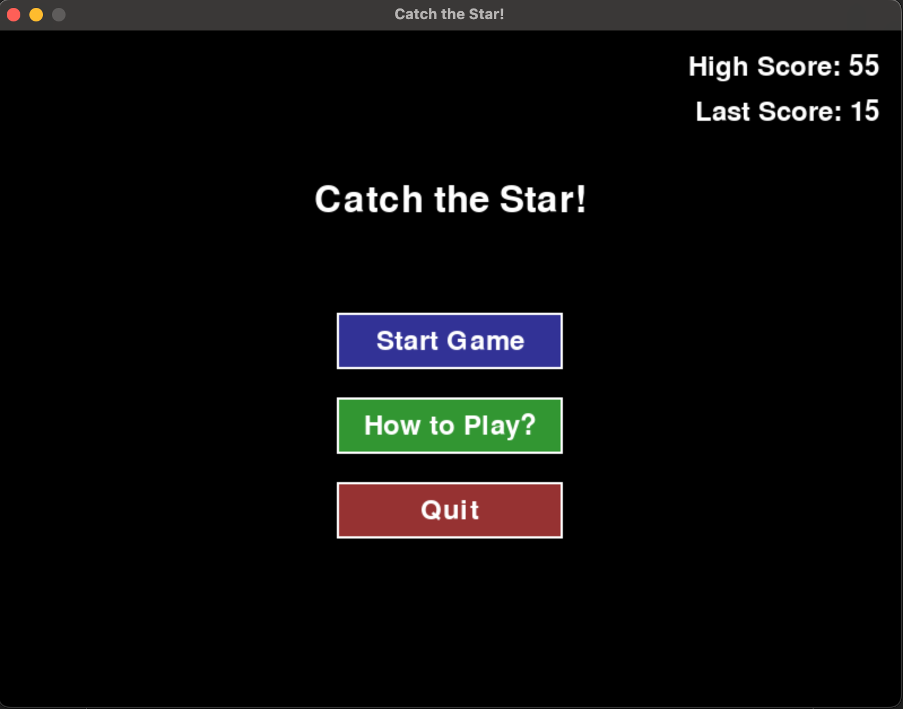
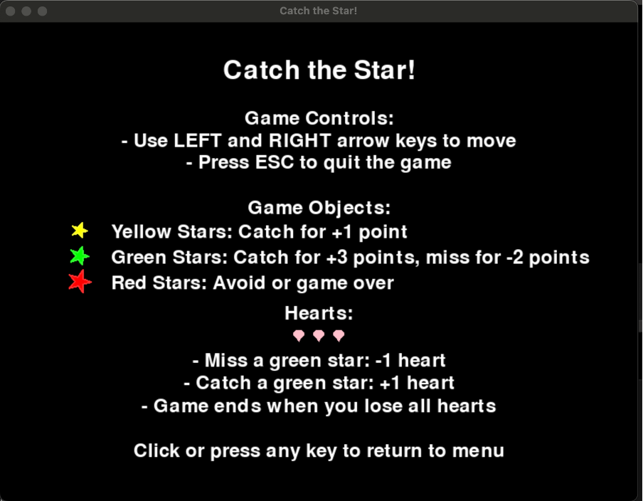
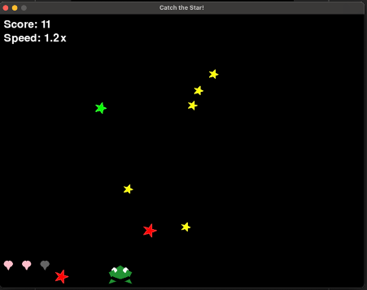
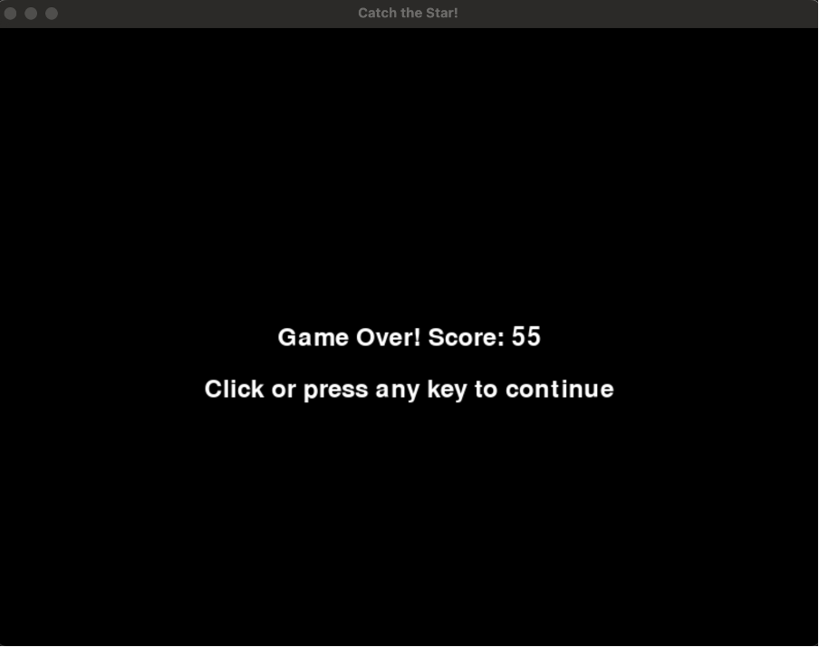

# Catch the Star

A fun arcade-style game where you control a frog trying to catch falling stars while avoiding obstacles.

## Screenshots

### Home Screen


### How to Play


### Gameplay


### Game Over


## Quick Start

1. Install requirements:
   ```bash
   pip install pygame
   ```

2. Run the game:
   ```bash
   python catch_the_star.py
   ```

## Game Description

Control a cute frog character to catch falling stars of different colors:
- 🌟 Yellow stars give you 1 point
- 💚 Green stars give you 3 points and restore 1 heart
- ❌ Red stars end your game on contact

Miss a green star and you'll lose a heart (and 2 points). Lose all hearts and it's game over!

The game gets progressively harder as your score increases, with stars falling faster (speed increases every 10 points).

## Features

- **Multiple Game Screens:**
  - Home screen with menu options
  - Detailed instructions screen
  - Dynamic gameplay screen
  - Game over screen with final score

- **Scoring System:**
  - Current score display
  - High score tracking
  - Last game score memory

- **Visual Elements:**
  - Custom-drawn frog character
  - Falling stars
  - Heart-based life system
  - Speed multiplier indicator

## Controls

- Use **LEFT** and **RIGHT** arrow keys to move the frog
- Press **ESC** at any time to quit
- Use mouse or keyboard for menu navigation

## Requirements

- Python 3.12 or higher
- Pygame 2.6.1 or higher

## Installation

1. Make sure you have Python installed
2. Install Pygame:
   ```bash
   pip install pygame
   ```

## How to Play

Run the game using:
```bash
python catch_the_star.py
```