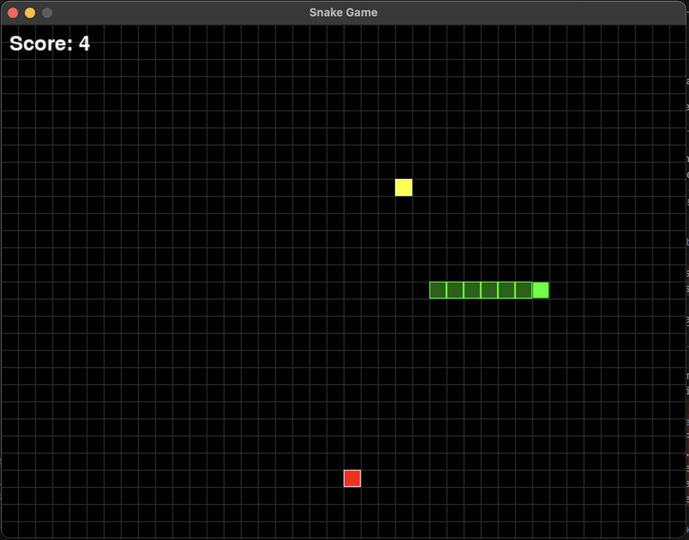
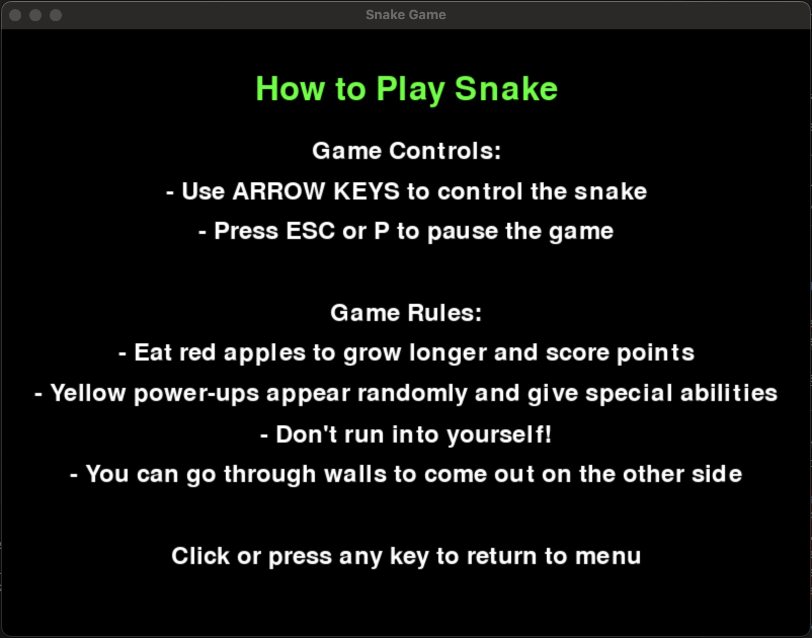

# Snake Game

A classic Snake game implementation using Pygame.





## Game features:

- Simple and intuitive controls
- Power-ups that provide bonus points
- Screen wrapping (go through walls to come out the other side)
- High score tracking

## Game Elements

- **Snake**: The green character you control
- **Red apples**: Regular food that gives 1 point and makes your snake grow
- **Yellow power-ups**: Special items that give 5 bonus points
- **Score**: Displayed in the top-left corner
- **High score**: Your best score, shown in the menu

## Requirements

- Python 3.x
- Pygame

## Running the Game

```
python snake_game.py
```

Enjoy!